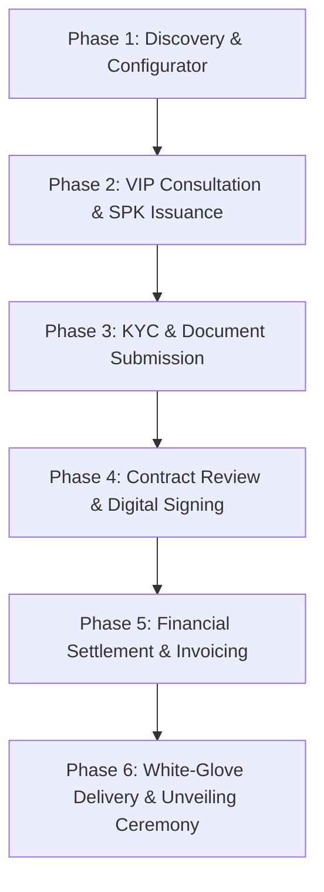

# BUSINESS REQUIREMENT DOCUMENT (BRD)
## End-to-End Luxury Supercar & Hypercar Acquisition Process
**Application:** PT Apex Automotive Indonesia Web Platform  
**Version:** 1.0.0  
**Date:** September 3, 2026  

---

## 1. Executive Summary & Business Context

Membeli sebuah **Supercar atau Hypercar** (bernilai Rp 6 Miliar hingga Rp 50 Miliar+) di PT Apex Automotive Indonesia bukanlah sekadar transaksi e-commerce konvensional (*add to cart & instant checkout*). Pembelian kendaraan mewah membutuhkan **High-Touch Luxury Experience**, kepatuhan hukum (*KYC & Tax Compliance*), verifikasi dokumen resmi negara, negosiasi SPK (Surat Pemesanan Kendaraan), tanda tangan digital sah (*e-Meterai / e-Sign*), skema pembayaran terverifikasi, hingga seremoni serah terima (*White-Glove Enclosed Delivery Ceremony*).

Dokumen BRD ini mendefinisikan seluruh alur proses bisnis dari sudut pandang **Pembeli (Buyer/UHNWI)** dan **Internal Showroom (Sales RM & Legal/Finance Officer)** untuk diimplementasikan secara digital pada platform web Apex Automotive.

---

## 2. Actors & User Roles

| Role | Description |
| :--- | :--- |
| **VIP Buyer (Customer)** | Ultra-High-Net-Worth Individual (UHNWI) atau perwakilan korporat yang melakukan penelusuran, kustomisasi spesifikasi, pengunggahan dokumen, tanda tangan kontrak, dan konfirmasi pengiriman. |
| **Sales Relationship Manager (RM)** | Konsultan otomotif dedicated dari Apex Automotive yang memandu pembeli, menyusun SPK, dan memverifikasi kustomisasi opsi mobil. |
| **Compliance & Finance Officer** | Tim internal yang memverifikasi keabsahan dokumen identitas (KTP/NPWP/NIB), validasi pembayaran (Down Payment/Pelunasan), serta penerbitan Faktur & STNK. |
| **Logistics & Concierge Specialist** | Tim penanggung jawab pengiriman kendaraan mengunakan *Enclosed Flatbed Tow Truck* dan eksekusi seremoni serah terima (*VIP Unveiling Ceremony*). |

---

## 3. End-to-End Customer Purchase Journey (6 Phases)



---

### 📌 PHASE 1: Discovery & Specification Configuration
* **Tujuan:** Pembeli memilih unit mobil dari etalase, menentukan varian warna eksterior atau paket bodykit/aero stage, dan mengajukan konsultasi privat.
* **Langkah Pembeli:**
  1. Pembeli menjelajahi etalase showroom (misal: *Lamborghini Revuelto* atau *BMW M4 Competition*).
  2. Pembeli masuk ke mode **Car Inspector & Configurator** untuk membandingkan varian warna eksterior dan paket bodykit (`KIT 01`, `KIT 02`, dst.).
  3. Pembeli mengklik **"BOOK THIS SPEC"** atau **"REQUEST PRIVATE CONSULTATION"**.
  4. Pembeli mengisi formulir awal: Nama Lengkap, Nomor WhatsApp/Telepon, Lokasi, dan Jadwal Konsultasi yang diinginkan.
* **Output System:** Tiket Prospek Baru (*Lead Ticket*) dibuat dan Sales Relationship Manager (RM) otomatis ditugaskan.

---

### 📌 PHASE 2: VIP Consultation & SPK Issuance
* **Tujuan:** Diskusi mendalam antara Pembeli dan Sales RM mengenai detail spesifikasi, kustomisasi opsional, opsi trade-in (jika ada), serta perhitungan harga resmi.
* **Langkah Pembeli & Sales RM:**
  1. Sales RM menghubungi pembeli atau memfasilitasi konsultasi di Showroom Pondok Indah / Private Lounge.
  2. RM menyusun **Surat Pemesanan Kendaraan (SPK)** draft melalui sistem internal.
  3. SPK berisi:
     - Rincian Unit Mobil & VIN/Chassis Number (jika ready stock) atau Production Slot.
     - Rincian Paket Warna / Bodykit / Opsi Interior Tambahan.
     - Rincian Harga On-The-Road (OTR) / Off-The-Road, PPN, PPnBM, BBN-KB.
     - Estimasi Waktu Pengiriman.
  4. Pembeli menerima pemberitahuan di Portal Customer: **"SPK Ready for Review"**.

---

### 📌 PHASE 3: Legal Verification & Document Submission (KYC & Compliance)
* **Tujuan:** Pengumpulan dokumen resmi untuk proses legalitas pendaftaran STNK, BPKB, dan kepatuhan perpajakan/anti-money laundering.
* **Langkah Pembeli:**
  1. Pembeli login ke **VIP Buyer Dashboard**.
  2. Pembeli mengunggah dokumen persyaratan sesuai tipe kepemilikan:
     * **Atas Nama Perorangan:**
       - Foto KTP / Passport Pembeli & Pemilik di STNK
       - Kartu Keluarga (KK)
       - NPWP (Nomor Pokok Wajib Pajak)
     * **Atas Nama PT / Korporasi:**
       - KTP Direksi
       - NPWP Perusahaan & NIB (Nomor Induk Berusaha)
       - Akta Pendirian & SK Menkumham
  3. Pembeli dapat memantau status verifikasi secara real-time (*Pending Review* ➔ *Approved* / *Revision Required*).

---

### 📌 PHASE 4: Contract Review & Digital Signing (E-Sign & e-Meterai)
* **Tujuan:** Pengesahan dokumen perjanjian jual beli secara hukum yang mengikat kedua belah pihak.
* **Langkah Pembeli:**
  1. Setelah dokumen KYC disetujui oleh Compliance Officer, sistem memicu pembuatan **Sales & Purchase Agreement (SPA)** final.
  2. Pembeli menerima dokumen digital SPA berserta invoice pembayaran.
  3. Pembeli dapat meninjau pasal-pasal garansi resmi 7 tahun, servis berkala, dan ketentuan serah terima.
  4. Pembeli membubuhkan **Tanda Tangan Digital Sah** (*Intergrasi e-Meterai & Digital Signature*).
  5. Pihak Manajemen PT Apex Automotive Indonesia menandatangani dokumen yang sama.

---

### 📌 PHASE 5: Financial Settlement (Booking Fee, DP & Full Payment)
* **Tujuan:** Penyelesaian kewajiban pembayaran melalui metode aman yang terverifikasi.
* **Pilihan Skema Pembayaran:**
  * **Option A — Full Cash / Bank Transfer:** Transfer langsung ke Rekening Escrow Terproteksi PT Apex Automotive Indonesia.
  * **Option B — VIP Concierge Finance / Leasing:** Pembayaran Booking Fee + DP (misal 30%), sisanya melalui pelunasan lembaga pembiayaan mitra mewah.
* **Langkah Pembeli:**
  1. Pembeli melakukan pembayaran Booking Fee (misal: Rp 100.000.000) untuk mengunci unit/slot produksi.
  2. Pembeli mengunggah bukti transfer atau mendapatkan konfirmasi otomatis dari *Payment Gateway Escrow*.
  3. Pembeli melakukan pelunasan / DP sesuai skema SPK.
  4. Sistem otomatis menerbitkan **Official Digital Receipt** dan **Faktur Pajak**.

---

### 📌 PHASE 6: White-Glove Enclosed Delivery & Unveiling Ceremony
* **Tujuan:** Pengiriman kendaraan mewah secara privat dan seremoni pembukaan kain penutup mobil (*VIP Ribbon Unveiling*) di lokasi pilihan pembeli.
* **Langkah Pembeli:**
  1. Pembeli memilih **Alamat Pengiriman Utama** (Garasi Pribadi / Penthouse / Showroom Collection).
  2. Pembeli memilih **Tanggal & Jam Pengiriman** yang diinginkan.
  3. Pembeli dapat menambahkan **Special Requests for Delivery Ceremony**:
     - *Custom Champagne Toast*
     - *Car Covered with Satin Velvet Sheet & Red Ribbon*
     - *Professional Videography / Drone Footage*
  4. Pada hari H, armada *Towing Enclosed Flatbed Apex* tiba di lokasi.
  5. Pembeli menandatangani **Digital Handover Checklist & Inspection Form**.
  6. Kunci Kendaraan, Certificate of Authenticity, Buku Servis, dan Garansi Resmi diaktifkan secara digital di akun pembeli.

---

## 4. Summary Table of Business Status Progression

| Status Code | Status Name | Description | Next Trigger Action |
| :--- | :--- | :--- | :--- |
| `INQUIRY_RECEIVED` | Lead Created | Pembeli mengirim permintaan kustomisasi dari etalase. | Sales RM menghubungi pembeli. |
| `CONSULTATION_ACTIVE` | In Discussion | Diskusi rincian spesifikasi & penawaran harga. | RM menyusun SPK. |
| `SPK_ISSUED` | SPK Ready | Draft SPK terbit, pembeli perlu mengulas. | Pembeli setuju SPK & masuk tahap KYC. |
| `KYC_PENDING` | Upload Documents | Pembeli mengunggah KTP, KK, NPWP. | Tim Legal/Compliance memverifikasi. |
| `KYC_APPROVED` | Verification Passed | Dokumen sah, kontrak jual beli diterbitkan. | Pembeli melakukan E-Sign. |
| `CONTRACT_SIGNED` | Agreement Executed | Kontrak SPA ditandatangani kedua pihak. | Pembeli bayar Booking Fee / DP. |
| `PAYMENT_VERIFIED` | Payment Completed | Dana masuk ke Escrow, Faktur terbit. | Penjadwalan pengiriman. |
| `SCHEDULED_DELIVERY` | In Towing Transit | Mobil diangkut truk tertutup ke lokasi pembeli. | Pengiriman & Seremoni. |
| `DELIVERED_COMPLETED` | Fully Handed Over | Seremoni selesai, garansi & sertifikat aktif. | Transaksi selesai (After Sales Mode). |

---

## 5. Technical Data Model Impact (Entity Relationship Overview)

Untuk mendukung alur bisnis di atas, sistem backend Laravel Apex Automotive akan membutuhkan tabel data berikut:

```
[Users] ──< [Orders/Transactions] ──< [SpkDetails]
                  │
                  ├──< [CustomerDocuments] (KTP, NPWP, KK)
                  ├──< [PaymentReceipts] (Booking Fee, DP, Pelunasan)
                  └──< [DeliveryDetails] (Alamat, Tanggal, Special Requests)
```

---
*Dokumen BRD ini disusun secara komprehensif sebagai acuan pengembangan sistem transaksi bisnis PT Apex Automotive Indonesia.*
